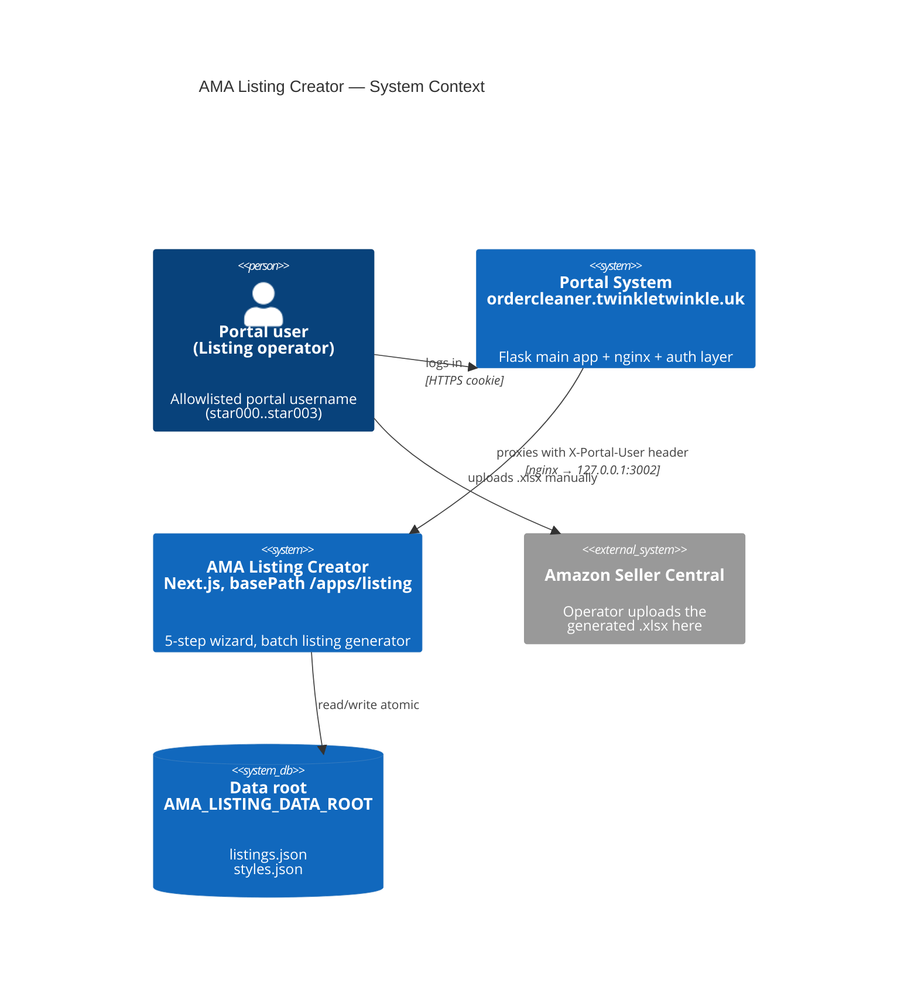
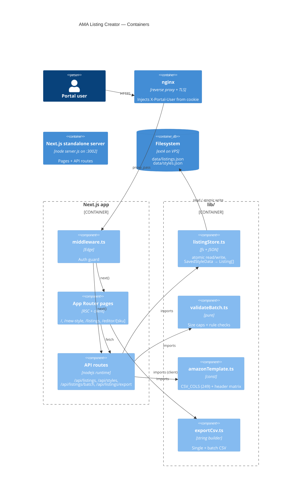
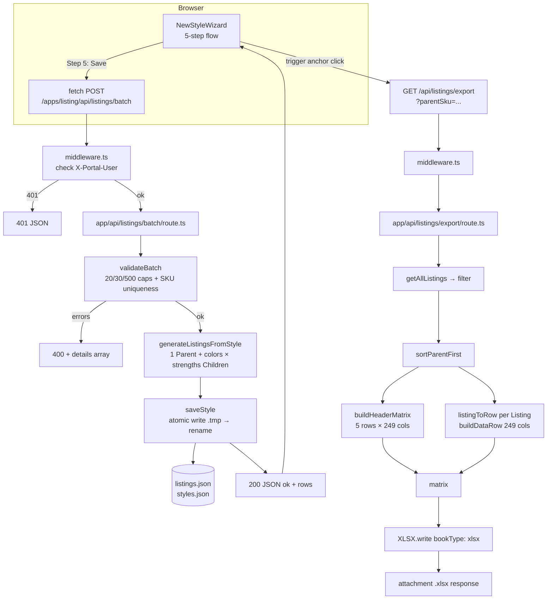
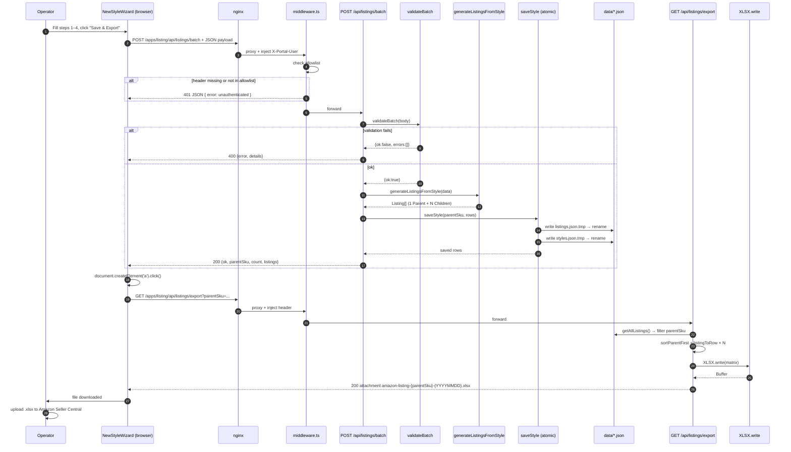

# AMA Listing Creator — Architecture

C4-style views of the system, from outermost context down to sequence and
deployment.

## Level 1 — System Context



## Level 2 — Containers



## Level 3 — Component Flow (New Style Wizard)



## Sequence — Wizard submit to .xlsx download



## Data Model

### `SavedStyleData` (wizard input / batch POST body)

```ts
{
  parentSku: string           // /^[A-Za-z0-9_-]+$/
  brand: string
  itemNameTemplate: string    // supports {parentSku} {color} {strength} tokens
  price: string               // Parent row leaves this blank
  quantity: string            // Parent row leaves this blank
  variationTheme: string      // default "COLOR/MAGNIFICATION_STRENGTH"
  colors: Array<{
    color: string
    colorCode: string         // used in child SKU, must be unique across colors
    colorMap: string          // Amazon colour_map
    mainImage: string         // http/https
    image2..image8?: string
  }>
  strengths: number[]         // e.g. [1.0, 1.5, 2.0, 2.5, 3.0, 3.5, 4.0]
  dimensions: {
    lensWidth? lensHeight? bridgeWidth? templeLength?
    frameWidth? itemWeight? frameMaterial? frameShape?
  }
  // Optional listing copy propagated to every row
  listingAction? bullet1..bullet5? description? keywords?
}
```

### `Listing` (persisted flat row)

```ts
{
  sku: string
  parentage: 'Parent' | 'Child'
  parentSku: string
  itemName? brand? variationTheme?
  // Child-only
  price? quantity? color? colorMap? strength?
  mainImage? image2..image8?
  // Shared copy
  listingAction? bullet1..bullet5? description? keywords?
  // Dimensions (stored on both Parent and Child)
  lensWidth? lensHeight? bridgeWidth? templeLength?
  frameWidth? itemWeight? frameMaterial? frameShape?
  source?: string            // style tag, typically = parentSku
}
```

### `StyleEntry` (index row in `styles.json`)

```ts
{
  parentSku: string
  variants: string[]    // child SKUs only
}
```

### Storage layout

```
<AMA_LISTING_DATA_ROOT>/
├── listings.json   # flat array of Listing rows (Parent + Children for all styles)
└── styles.json     # [{ parentSku, variants: [childSku, ...] }]
```

Writes are crash-safe: `writeJsonAtomic` writes to `<file>.tmp` then
`fs.renameSync` onto the real path (POSIX atomic rename).

## Deployment Topology

```mermaid
flowchart LR
    subgraph Internet
        C[Browser]
    end

    subgraph VPS
        N[nginx :443<br/>ordercleaner.twinkletwinkle.uk]
        subgraph portal_system[/opt/portal-system]
            F[Flask gunicorn sock]
            subgraph ama[apps/ama-listing-creator]
                S[.next/standalone/server.js<br/>node :3002 127.0.0.1]
                subgraph data[data/ persistent]
                    L[listings.json]
                    Y[styles.json]
                end
            end
        end
        SD[systemd: ama-listing.service<br/>User=portal-system]
    end

    C -->|HTTPS| N
    N -->|/apps/listing/*| S
    N -->|everything else| F
    SD -.manages.-> S
    S -->|AMA_LISTING_DATA_ROOT<br/>=/opt/portal-system/apps/ama-listing-creator/data| data
```

**Deploy pipeline** (`.github/workflows/deploy.yml`):

1. `git push origin main` in the `ama-listing-creator` submodule triggers
   GitHub Actions.
2. Actions SSHes to the VPS and, as `portal-system` user:
   - `git fetch origin && git reset --hard origin/main`
   - backup current `.next/standalone` → `/opt/deploy-backups/ama-listing-creator/<sha>` (keep last 5)
   - `npm install --no-audit --no-fund`
   - `npm run build` (produces `.next/standalone/` + `.next/static/`)
   - **`cp -r .next/static .next/standalone/.next/static`** — without this
     `/_next/static/*` returns 404 and the page renders unstyled. See
     ADR-001.
   - `cp -r public .next/standalone/public` if `public/` exists
   - `sudo cp deploy/ama-listing.service /etc/systemd/system/...`
   - `systemctl daemon-reload && systemctl restart ama-listing.service`
3. Post-deploy checks:
   - `systemctl is-active` on the unit
   - `curl http://127.0.0.1:3002/apps/listing` → expect 200/302/307
   - scrape HTML for `_next/static/*.(css|js)`, fetch one → expect 200
     (guards against the "HTML OK but assets missing" failure mode).

**systemd unit** (`deploy/ama-listing.service`):

- `User=portal-system`
- `WorkingDirectory=/opt/portal-system/apps/ama-listing-creator/.next/standalone`
- `ExecStart=/usr/bin/node server.js`
- `Environment=PORT=3002 HOSTNAME=127.0.0.1`
- `Environment=AMA_LISTING_DATA_ROOT=/opt/portal-system/apps/ama-listing-creator/data`
  (outside the standalone bundle, so deploys never clobber live data)

**Next.js config** (`next.config.ts`):

- `output: 'standalone'` — single node process, minimal deps copied
- `basePath: '/apps/listing'` + `assetPrefix: '/apps/listing'`
- `outputFileTracingRoot: __dirname_esm` — pinned to this project so the
  standalone bundle's `server.js` lands at `.next/standalone/server.js`
  instead of being nested under a long workspace path (see ADR-007).

## Runtime & Dependencies

| Piece                 | Version   | Notes                                     |
|-----------------------|-----------|-------------------------------------------|
| Next.js               | 16.2.1    | App Router, standalone output             |
| React / React DOM     | 19.2.4    | Server + client components                |
| xlsx                  | ^0.18.5   | Only external runtime dep for workbook    |
| Node                  | (system)  | systemd unit runs `/usr/bin/node`         |
| Data store            | JSON files on disk (see ADR-002)                      |
